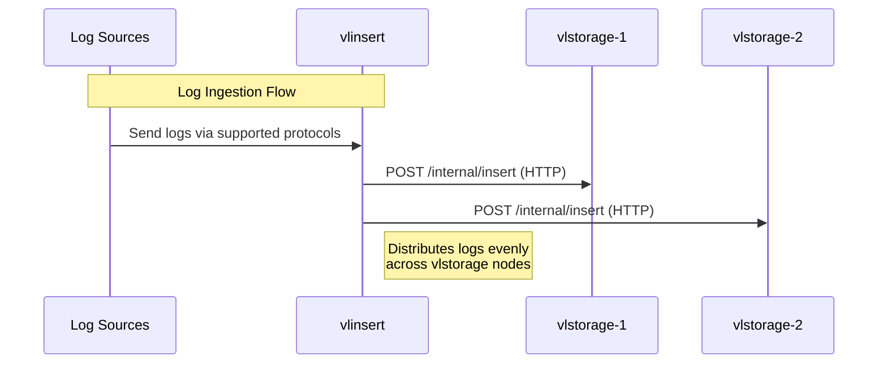
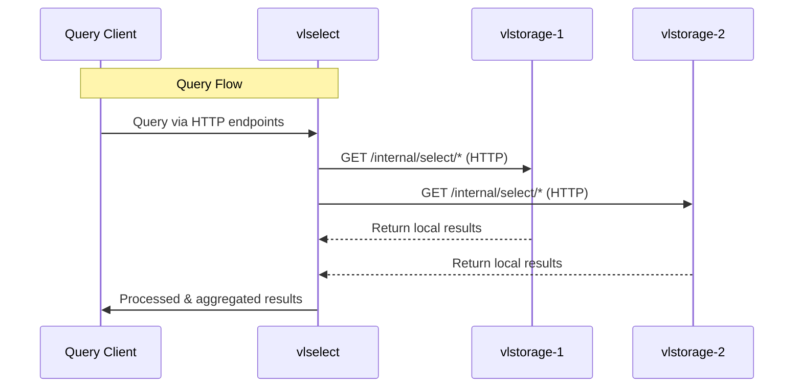
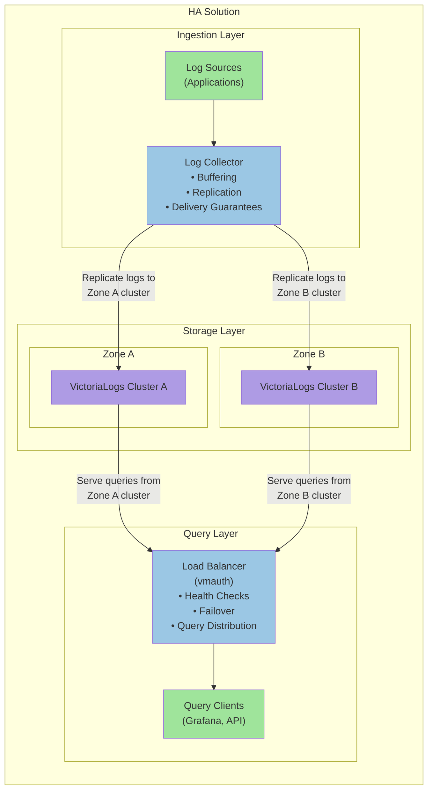

Cluster mode in VictoriaLogs provides horizontal scaling to many nodes when [single-node VictoriaLogs](https://docs.victoriametrics.com/victorialogs/)
reaches vertical scalability limits of a single host. If you have the ability to run a single-node VictoriaLogs on a host with more CPU / RAM / storage space / storage IO,
then it is preferred to do this instead of switching to cluster mode, since a single-node VictoriaLogs instance has the following advantages over cluster mode:

- It is easier to configure, manage and troubleshoot, since it consists of a single self-contained component.
- It provides better performance and capacity on the same hardware, since it doesn't need
  to transfer data over the network between cluster components.

The migration path from a single-node VictoriaLogs to cluster mode is very easy - just [upgrade](https://docs.victoriametrics.com/victorialogs/#upgrading)
a single-node VictoriaLogs executable to the [latest available release](https://docs.victoriametrics.com/victorialogs/changelog/) and add it to the list of `vlstorage` nodes
passed via `-storageNode` command-line flag to `vlinsert` and `vlselect` components of the cluster mode. See [cluster architecture](https://docs.victoriametrics.com/victorialogs/cluster/#architecture)
for more details about VictoriaLogs cluster components.

See [quick start guide](https://docs.victoriametrics.com/victorialogs/cluster/#quick-start) on how to start working with VictoriaLogs cluster.

## Architecture

VictoriaLogs in cluster mode is composed of three main components: `vlinsert`, `vlselect`, and `vlstorage`. 

Ingestion flow:



Querying flow:



- `vlinsert` handles log ingestion via [all supported protocols](https://docs.victoriametrics.com/victorialogs/data-ingestion/).  
  It distributes (shards) incoming logs evenly across `vlstorage` nodes, as specified by the `-storageNode` command-line flag.

- `vlselect` receives queries through [all supported HTTP query endpoints](https://docs.victoriametrics.com/victorialogs/querying/).  
  It fetches the required data from the configured `vlstorage` nodes, processes the queries, and returns the results.

- `vlstorage` performs two key roles:
  - It stores logs received from `vlinsert` at the directory defined by the `-storageDataPath` flag.  
    See [storage configuration docs](https://docs.victoriametrics.com/victorialogs/#storage) for details.
  - It handles queries from `vlselect` by retrieving and transforming the requested data locally before returning results.

Each `vlstorage` node operates as a self-contained VictoriaLogs instance.  
Refer to the [single-node and cluster mode duality](https://docs.victoriametrics.com/victorialogs/cluster/#single-node-and-cluster-mode-duality) documentation for more information.  
This design allows you to reuse existing single-node VictoriaLogs instances by listing them in the `-storageNode` flag for `vlselect`, enabling unified querying across all nodes.

All VictoriaLogs components are horizontally scalable and can be deployed on hardware best suited to their respective workloads.  
`vlinsert` and `vlselect` can be run on the same node, which allows the minimal cluster to consist of just one `vlstorage` node and one node acting as both `vlinsert` and `vlselect`.  
However, for production environments, it is recommended to separate `vlinsert` and `vlselect` roles to avoid resource contention — for example, to prevent heavy queries from interfering with log ingestion.

Communication between `vlinsert` / `vlselect` and `vlstorage` is done via HTTP over the port specified by the `-httpListenAddr` flag:

- `vlinsert` sends data to the `/internal/insert` endpoint on `vlstorage`.
- `vlselect` sends queries to endpoints under `/internal/select/` on `vlstorage`.

This HTTP-based communication model allows you to use reverse proxies for authorization, routing, and encryption between components.  
Use of [vmauth](https://docs.victoriametrics.com/victoriametrics/vmauth/) is recommended for managing access control.
See [Security and Load balancing docs](https://docs.victoriametrics.com/victorialogs/security-and-lb/) for details.

For advanced setups, refer to the [multi-level cluster setup](https://docs.victoriametrics.com/victorialogs/cluster/#multi-level-cluster-setup) documentation.

## High availability

VictoriaLogs cluster provides high availability for [data ingestion path](https://docs.victoriametrics.com/victorialogs/data-ingestion/).
It continues to accept incoming logs if some of the `vlstorage` nodes are temporarily unavailable.
`vlinsert` evenly spreads new logs among the remaining available `vlstorage` nodes in this case, so newly ingested logs are properly stored and are available for querying
without any delays. This allows performing maintenance tasks for `vlstorage` nodes (such as upgrades, configuration updates, etc.) without worrying about data loss.
Make sure that the remaining `vlstorage` nodes have enough capacity for the increased data ingestion workload, in order to avoid availability problems.

VictoriaLogs cluster returns `502 Bad Gateway` errors for [incoming queries](https://docs.victoriametrics.com/victorialogs/querying/)
if some of the `vlstorage` nodes are unavailable. This guarantees consistent query responses
(e.g. all the stored logs are taken into account during the query) during maintenance tasks at `vlstorage` nodes. Note that all the newly incoming logs are properly stored
to the remaining `vlstorage` nodes - see the paragraph above, so they become available for querying immediately after all the `vlstorage` nodes return back to the cluster.

There are practical cases when it is preferred to return partial responses instead of `502 Bad Gateway` errors if some of `vlstorage` nodes are unavailable.
See [these docs](https://docs.victoriametrics.com/victorialogs/querying/#partial-responses) on how to achieve this.

> [!NOTE] Insight
> In most real-world cases, `vlstorage` nodes become unavailable during planned maintenance such as upgrades, config changes, or rolling restarts. 
> These are typically infrequent (weekly or monthly) and brief (a few minutes) events.
> <br>
> <br>
> A short period of query downtime during maintenance tasks is acceptable and fits well within most SLAs. For example, 43 minutes of downtime per month during maintenance tasks
> provides ~99.9% cluster availability. This is better in practice compared to "magic" HA schemes with opaque auto-recovery — if these schemes fail,
> then it is impossible to debug and fix them in a timely manner, so this will likely result in a long outage, which violates SLAs.

The real HA scheme for both data ingestion and querying can be built only when copies of logs are sent into independent VictoriaLogs instances (or clusters)
located in fully independent availability zones (datacenters). 

If an AZ becomes unavailable, then new logs continue to be written to the remaining AZ,
while queries return full responses from the remaining AZ. When the AZ becomes available, then the pending buffered logs can be written to it, so the AZ
can be used for querying full responses. This HA scheme can be built with the help of [vlagent](https://docs.victoriametrics.com/victorialogs/vlagent/)
for data replication and buffering, and [vmauth](https://docs.victoriametrics.com/victoriametrics/vmauth/) for data querying:



- [vlagent](https://docs.victoriametrics.com/victorialogs/vlagent/) receives and replicates logs to two VictoriaLogs clusters.
  If one cluster becomes unavailable, the log shipper continues sending logs to the remaining healthy cluster. It also buffers logs that cannot be delivered to the unavailable cluster.
  When the failed cluster becomes available again, the log shipper sends the buffered logs and then resumes sending new logs to it. This guarantees that both clusters have full copies
  of all the ingested logs.
- [vmauth](https://docs.victoriametrics.com/victoriametrics/vmauth/) routes query requests to healthy VictoriaLogs clusters.
  If one cluster becomes unavailable, `vmauth` detects this and automatically redirects all query traffic to the remaining healthy cluster.

There is no magic coordination logic or consensus algorithms in this scheme. This simplifies managing and troubleshooting this HA scheme.

See also [replication](https://docs.victoriametrics.com/victorialogs/cluster/#replication) and [Security and Load balancing docs](https://docs.victoriametrics.com/victorialogs/security-and-lb/).

## Replication

`vlinsert` doesn't replicate incoming logs among `vlstorage` nodes. Instead, it spreads evenly (shards) incoming logs among `vlstorage` nodes specified in the `-storageNode` command-line flag.
This provides cost-efficient linear scalability for the cluster capacity, data ingestion performance and querying performance proportional to the number of `vlstorage` nodes.

It is recommended making regular backups for the data stored across all the `vlstorage` nodes in order to make sure that the data isn't lost in case of any disaster
(such as accidental data removal because of incorrect config updates or incorrect upgrades, or physical corruption of the data on the persistent storage).
See [how to backup and restore data for VictoriaLogs - these docs apply to vlstorage nodes](https://docs.victoriametrics.com/victorialogs/#backup-and-restore).

If you need restoring the data between the backup time and the current time, then it is recommended building
[HA setup for VictoriaLogs cluster](https://docs.victoriametrics.com/victorialogs/cluster/#high-availability),
so you could copy the needed per-day partitions from cluster replica.

Usually the disaster event occurs rarely (e.g. once per year). Every such event has unique preconditions and consequences,
so it is impossible to automate recovering from disaster events. These events require human attention and carefully thought manual actions,
so there is little practical sense in relying on automatic data recovery from the magically replicated data among storage nodes.

## Single-node and cluster mode duality

Every `vlstorage` node can be used as a single-node VictoriaLogs instance:

- It can accept logs via [all the supported data ingestion protocols](https://docs.victoriametrics.com/victorialogs/data-ingestion/).
- It can accept `select` queries via [all the supported HTTP querying endpoints](https://docs.victoriametrics.com/victorialogs/querying/).

A single-node VictoriaLogs instance can be used as `vlstorage` node in VictoriaLogs cluster:

- It accepts data ingestion requests from `vlinsert` via `/internal/insert` HTTP endpoint at the TCP port specified via `-httpListenAddr` command-line flag.
- It accepts queries from `vlselect` via `/internal/select/*` HTTP endpoints at the TCP port specified via `-httpListenAddr` command-line flag.

See also [security docs](https://docs.victoriametrics.com/victorialogs/cluster/#security).

## Multi-level cluster setup

- `vlinsert` can send the ingested logs to other `vlinsert` nodes if they are specified via `-storageNode` command-line flag.
  This allows building multi-level data ingestion schemes when top-level `vlinsert` spreads the incoming logs evenly among multiple lower-level clusters of VictoriaLogs.

- `vlselect` can send queries to other `vlselect` nodes if they are specified via `-storageNode` command-line flag.
  This allows building multi-level cluster schemes when top-level `vlselect` queries multiple lower-level clusters of VictoriaLogs.

See [security docs](https://docs.victoriametrics.com/victorialogs/cluster/#security) on how to protect communications between multiple levels of `vlinsert` and `vlselect` nodes.

## Security

All the VictoriaLogs cluster components must run in a protected internal network without direct access from the Internet.
`vlstorage` must have no access from the Internet. HTTP authorization proxies such as [vmauth](https://docs.victoriametrics.com/victoriametrics/vmauth/)
must be used in front of `vlinsert` and `vlselect` for authorizing access to these components from the Internet.
See [Security and Load balancing docs](https://docs.victoriametrics.com/victorialogs/security-and-lb/).

It is possible to disallow access to `/internal/insert` and `/internal/select/*` endpoints at a single-node VictoriaLogs instance
by running it with `-internalinsert.disable` and `-internalselect.disable` command-line flags. Note that [`vlagent`](https://docs.victoriametrics.com/victorialogs/vlagent/)
sends the collected logs to the `/internal/insert` endpoint, so it should be available for data ingestion if you use `vlagent`.

### TLS

By default, `vlinsert` and `vlselect` communicate with `vlstorage` via unencrypted HTTP. This is OK if all these components are located
in the same protected internal network. This isn't OK if these components communicate over the Internet, since a third party can intercept or modify
the transferred data. It is recommended to switch to HTTPS in this case:

- Specify `-tls`, `-tlsCertFile` and `-tlsKeyFile` command-line flags at `vlstorage`, so it accepts incoming requests over HTTPS instead of HTTP at the corresponding `-httpListenAddr`:

  ```sh
  ./victoria-logs-prod -httpListenAddr=... -storageDataPath=... -tls -tlsCertFile=/path/to/certfile -tlsKeyFile=/path/to/keyfile
  ```

- Specify `-storageNode.tls` command-line flag at `vlinsert` and `vlselect`, which communicate with the `vlstorage` over untrusted networks such as the Internet:

  ```sh
  ./victoria-logs-prod -storageNode=... -storageNode.tls
  ```

It is also recommended to authorize HTTPS requests to `vlstorage` via Basic Auth:

- Specify `-httpAuth.username` and `-httpAuth.password` command-line flags at `vlstorage`, so it verifies the Basic Auth username + password in HTTPS requests received via `-httpListenAddr`:

  ```sh
  ./victoria-logs-prod -httpListenAddr=... -storageDataPath=... -tls -tlsCertFile=... -tlsKeyFile=... -httpAuth.username=... -httpAuth.password=...
  ```

- Specify `-storageNode.username` and `-storageNode.password` command-line flags at `vlinsert` and `vlselect`, which communicate with the `vlstorage` over untrusted networks:

  ```sh
  ./victoria-logs-prod -storageNode=... -storageNode.tls -storageNode.username=... -storageNode.password=...
  ```

Another option is to use third-party HTTP proxies such as [vmauth](https://docs.victoriametrics.com/victoriametrics/vmauth/), `nginx`, etc. to authorize and encrypt communications
between VictoriaLogs cluster components over untrusted networks.

By default, all the components (vlinsert, vlselect, vlstorage) support all the HTTP endpoints including `/insert/*` and `/select/*`.
It is recommended to disable select endpoints on `vlinsert` and insert endpoints on `vlselect`:

```sh
# Disable select endpoints on vlinsert
./victoria-logs-prod -storageNode=... -select.disable

# Disable insert endpoints on vlselect
./victoria-logs-prod -storageNode=... -insert.disable
```

This helps prevent sending select requests to `vlinsert` nodes or insert requests to `vlselect` nodes in case of a misconfiguration in the authorization proxy
in front of the `vlinsert` and `vlselect` nodes.

See also [mTLS](https://docs.victoriametrics.com/victorialogs/cluster/#mtls).

### mTLS

[Enterprise version of VictoriaLogs](https://docs.victoriametrics.com/victoriametrics/enterprise/) supports the ability to verify client TLS certificates
at the `vlstorage` side for TLS connections established from `vlinsert` and `vlselect` nodes (aka [mTLS](https://en.wikipedia.org/wiki/Mutual_authentication#mTLS)).
See [TLS docs](https://docs.victoriametrics.com/victorialogs/cluster/#tls) for details on how to set up TLS communications between VictoriaLogs cluster nodes.

mTLS authentication can be enabled by passing the `-mtls` command-line flag to the `vlstorage` node in addition to the `-tls` command-line flag.
In this case it verifies TLS client certificates for connections from `vlinsert` and `vlselect` at the address specified via `-httpListenAddr` command-line flag.

The client TLS certificate must be specified at `vlinsert` and `vlselect` nodes via `-storageNode.tlsCertFile` and `-storageNode.tlsKeyFile` command-line flags.

By default, the system-wide [root CA certificates](https://en.wikipedia.org/wiki/Root_certificate) are used for verifying client TLS certificates.
The `-mtlsCAFile` command-line flag can be used at `vlstorage` for pointing to custom root CA certificates.

See also [generic mTLS docs for VictoriaLogs](https://docs.victoriametrics.com/victorialogs/#mtls).

[Enterprise version of VictoriaLogs](https://docs.victoriametrics.com/victoriametrics/enterprise/) can be downloaded and evaluated for free
from [the releases page](https://github.com/VictoriaMetrics/VictoriaLogs/releases/latest). See [how to request a free trial license](https://victoriametrics.com/products/enterprise/trial/).

## Rebalancing

Every `vlinsert` node spreads evenly (shards) incoming logs among `vlstorage` nodes specified in the `-storageNode` command-line flag
according to the [VictoriaLogs cluster architecture](https://docs.victoriametrics.com/victorialogs/cluster/#architecture).
This guarantees that the data is spread evenly among `vlstorage` nodes. When new `vlstorage` nodes are added to the `-storageNode` list
at `vlinsert`, then all the newly ingested logs are spread evenly among old and new `vlstorage` nodes, while historical data remains
on the old `vlstorage` nodes. This improves data ingestion performance and querying performance for typical production workloads,
since newly ingested logs are spread evenly across all the `vlstorage` nodes, while typical queries are performed over the newly ingested logs,
which are already present among all the `vlstorage` nodes. This also provides the following benefits comparing to the scheme
with automatic data rebalancing:

- Cluster performance remains reliable just after adding new `vlstorage` nodes, since network bandwidth, disk IO and CPU resources
  aren't spent on automatic data rebalancing, which may take days for re-balancing of petabytes of data.
- This eliminates the whole class of hard-to-troubleshoot and resolve issues, which may happen with the cluster during automatic data rebalancing.
  For example, what happens if some of `vlstorage` nodes become unavailable during the re-balancing? Or what happens if new `vlstorage` nodes
  are added while the previous data re-balancing isn't finished yet?
- This allows building flexible cluster schemes where distinct subsets of `vlinsert` nodes spread incoming logs among different subsets of `vlstorage`
  nodes with different configs and different hardware resources.

The following approaches exist for manual data re-balancing among old and new `vlstorage` nodes if it is really needed:

- To wait until historical data is automatically deleted from old `vlstorage` nodes according to the configured [retention](https://docs.victoriametrics.com/victorialogs/#retention).
  Then old and new `vlstorage` nodes will have equal amounts of data.
- To configure `vlinsert` to write newly ingested logs only to new `vlstorage` nodes, while `vlselect` nodes should continue querying data from all the `vlstorage` nodes.
  Then wait until the data size on the new `vlstorage` nodes becomes equal to the data size on the old `vlstorage` nodes, and return back old `vlstorage` nodes
  to `-storageNode` list at `vlinsert`.
- To manually move historical per-day partitions from old `vlstorage` nodes to new `vlstorage` nodes. VictoriaLogs provides the functionality, which simplifies
  doing this work without the need to stop or restart `vlstorage` nodes - see [partitions lifecycle docs](https://docs.victoriametrics.com/victorialogs/#partitions-lifecycle).

## Quick start

The following topics for are covered below:

- How to download the VictoriaLogs executable.
- How to start a VictoriaLogs cluster, which consists of two `vlstorage` nodes, a single `vlinsert` node and a single `vlselect` node
  running on localhost according to [cluster architecture](https://docs.victoriametrics.com/victorialogs/cluster/#architecture).
- How to ingest logs into the cluster.
- How to query the ingested logs.

If you want running VictoriaLogs cluster in Kubernetes, then please read [these docs](https://docs.victoriametrics.com/helm/victorialogs-cluster/).

Download and unpack the latest VictoriaLogs release:

```sh
curl -L -O https://github.com/VictoriaMetrics/VictoriaLogs/releases/download/v1.37.2/victoria-logs-linux-amd64-v1.37.2.tar.gz
tar xzf victoria-logs-linux-amd64-v1.37.2.tar.gz
```

Start the first [`vlstorage` node](https://docs.victoriametrics.com/victorialogs/cluster/#architecture), which accepts incoming requests at the port `9491` and stores the ingested logs in the `victoria-logs-data-1` directory:

```sh
./victoria-logs-prod -httpListenAddr=:9491 -storageDataPath=victoria-logs-data-1 &
```

This command and all the following commands start cluster components as background processes.
Use `jobs`, `fg`, `bg` commands for manipulating the running background processes. Use the `kill` command and/or `Ctrl+C` to stop running processes when they are no longer needed.
See [these docs](https://tldp.org/LDP/abs/html/x9644.html) for details.

Start the second `vlstorage` node, which accepts incoming requests at the port `9492` and stores the ingested logs in the `victoria-logs-data-2` directory:

```sh
./victoria-logs-prod -httpListenAddr=:9492 -storageDataPath=victoria-logs-data-2 &
```

Start the `vlinsert` node, which [accepts logs](https://docs.victoriametrics.com/victorialogs/data-ingestion/) at the port `9481` and spreads them evenly across the two `vlstorage` nodes started above:

```sh
./victoria-logs-prod -httpListenAddr=:9481 -storageNode=localhost:9491,localhost:9492 &
```

Start the `vlselect` node, which [accepts incoming queries](https://docs.victoriametrics.com/victorialogs/querying/) at the port `9471` and requests the needed data from `vlstorage` nodes started above:

```sh
./victoria-logs-prod -httpListenAddr=:9471 -storageNode=localhost:9491,localhost:9492 &
```

Note that all the VictoriaLogs cluster components - `vlstorage`, `vlinsert` and `vlselect` - share the same executable - `victoria-logs-prod`.
Their roles depend on whether the `-storageNode` command-line flag is set - if this flag is set, then the executable runs in `vlinsert` and `vlselect` modes.
Otherwise, it runs in `vlstorage` mode, which is identical to a [single-node VictoriaLogs mode](https://docs.victoriametrics.com/victorialogs/).

Let's ingest some logs (aka [wide events](https://jeremymorrell.dev/blog/a-practitioners-guide-to-wide-events/))
from [GitHub archive](https://www.gharchive.org/) into the VictoriaLogs cluster with the following command:

```sh
curl -s https://data.gharchive.org/$(date -d '2 days ago' '+%Y-%m-%d')-10.json.gz \
        | curl -T - -X POST -H 'Content-Encoding: gzip' 'http://localhost:9481/insert/jsonline?_time_field=created_at&_stream_fields=type'
```

Let's query the ingested logs via [`/select/logsql/query` HTTP endpoint](https://docs.victoriametrics.com/victorialogs/querying/#querying-logs).
For example, the following command returns the number of stored logs in the cluster:

```sh
curl http://localhost:9471/select/logsql/query -d 'query=* | count()'
```

See [these docs](https://docs.victoriametrics.com/victorialogs/querying/#command-line) for details on how to query logs from the command line.

Logs can also be explored and queried via the [built-in Web UI](https://docs.victoriametrics.com/victorialogs/querying/#web-ui).
Open `http://localhost:9471/select/vmui/` in the web browser, select `last 7 days` time range in the top right corner and explore the ingested logs.
See [LogsQL docs](https://docs.victoriametrics.com/victorialogs/logsql/) to familiarize yourself with the query language.

Every `vlstorage` node can be queried individually because [it is equivalent to a single-node VictoriaLogs](https://docs.victoriametrics.com/victorialogs/cluster/#single-node-and-cluster-mode-duality).
For example, the following command returns the number of stored logs at the first `vlstorage` node started above:

```sh
curl http://localhost:9491/select/logsql/query -d 'query=* | count()'
```

We recommend reading [key concepts](https://docs.victoriametrics.com/victorialogs/keyconcepts/) before you start working with VictoriaLogs.

See also [security docs](https://docs.victoriametrics.com/victorialogs/cluster/#security).

## Performance tuning

Cluster components of VictoriaLogs automatically adjust their settings for the best performance and the lowest resource usage on the given hardware.
So there is no need for any tuning of these components in general. The following options can be used for achieving higher performance / lower resource
usage on systems with constrained resources:

- `vlinsert` limits the number of concurrent requests to every `vlstorage` node. The default concurrency works great in most cases.
  Sometimes it can be increased via `-insert.concurrency` command-line flag at `vlinsert` in order to achieve higher data ingestion rate
  at the cost of higher RAM usage at `vlinsert` and `vlstorage` nodes.

- `vlinsert` compresses the data sent to `vlstorage` nodes in order to reduce network bandwidth usage at the cost of slightly higher CPU usage
  at `vlinsert` and `vlstorage` nodes. The compression can be disabled by passing `-insert.disableCompression` command-line flag to `vlinsert`.
  This reduces CPU usage at `vlinsert` and `vlstorage` nodes at the cost of significantly higher network bandwidth usage.

- `vlselect` requests compressed data from `vlstorage` nodes in order to reduce network bandwidth usage at the cost of slightly higher CPU usage
  at `vlselect` and `vlstorage` nodes. The compression can be disabled by passing `-select.disableCompression` command-line flag to `vlselect`.
  This reduces CPU usage at `vlselect` and `vlstorage` nodes at the cost of significantly higher network bandwidth usage.

## Advanced usage

Cluster components of VictoriaLogs provide various settings, which can be configured via command-line flags if needed.
Default values for all the command-line flags work great in most cases, so it isn't recommended
tuning them without the real need. See [the list of supported command-line flags at VictoriaLogs](https://docs.victoriametrics.com/victorialogs/#list-of-command-line-flags).
